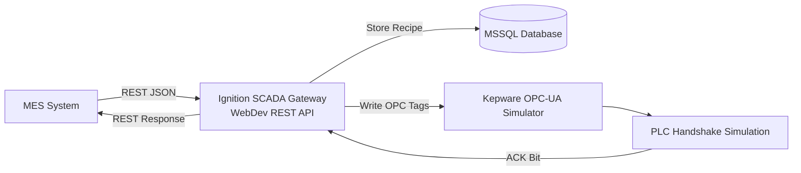
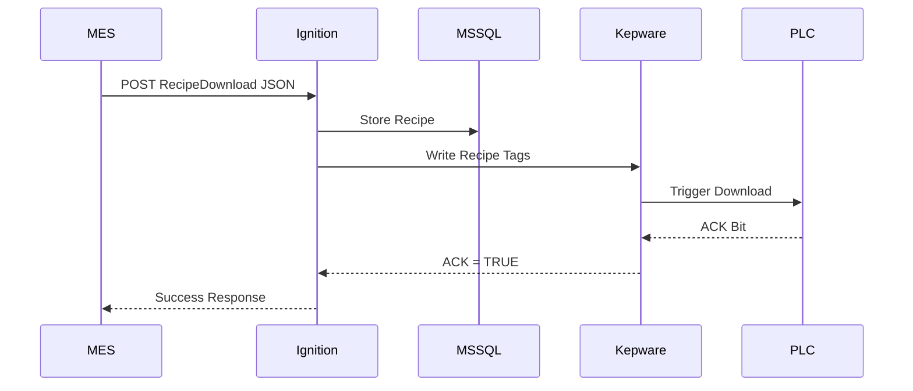

# readme_MES-RecipeDownload.md

# MES ↔ SCADA Recipe Download Integration

## Overview

This project demonstrates an industrial MES ↔ SCADA integration using:

- Ignition Gateway WebDev Module
- MSSQL Database
- Kepware OPC-UA Simulator
- Jython scripting inside Ignition
- REST API communication

The integration simulates a real manufacturing environment where:

1. MES sends Recipe Download JSON payload
2. Ignition SCADA receives the payload
3. Recipe data is stored into MSSQL
4. Recipe values are written to OPC tags
5. Simulated PLC handshake acknowledgment is generated
6. SCADA sends response back to MES

---

# High Level Architecture



---

# Technology Stack

| Component | Technology |
|---|---|
| SCADA | Ignition Gateway |
| REST API | Ignition WebDev Module |
| Database | MSSQL |
| OPC Server | Kepware |
| PLC Simulation | Kepware Simulator Tags |
| Scripting | Jython |
| Protocol | REST + OPC-UA |

---

# Integration Scenario

## Interface Name

```text
IDS-MI M2E.RecipeDownload
```

---

# End-to-End Flow



---
# Final Structure
``` daigram
MES
  |
  | REST API
  v
Ignition WebDev REST Endpoint
  |
  +-------------------+
  |                   |
  v                   v
MSSQL             Kepware OPC Tags
(Store Recipe)    (Simulate PLC)
  |                   |
  +--------+----------+
           |
           v
PLC Handshake Simulation
           |
           v
MES Response
```

# Project Structure

```text
Ignition Project
│
├── MESIntegration
│   │
│   ├── api
│   │   │
│   │   ├── recipeDownload
│   │   │       └── doPost
│   │
│   ├── gatewayEvents
│   │   │
│   │   └── plcAckSimulator
│   │
│   └── scripts
│           └── recipeHandler
```

---

# API Endpoint

## URL

```text
POST /system/webdev/MESIntegration/api/recipeDownload
```

---

# Flow 
MES Sends Recipe JSON

↓

Ignition:
Validates JSON
Stores recipe into MSSQL
Writes parameters to Kepware OPC tags
Triggers handshake bit
Waits for PLC ACK
Returns response to MES

# Database Design

## Table: MS SQL TABLES
### Recipe Header

```sql
CREATE TABLE MES_Recipe_Header (
    ID INT IDENTITY(1,1) PRIMARY KEY,
    WipOrderNo VARCHAR(100),
    Equipment VARCHAR(100),
    ProductNo VARCHAR(100),
    ProcessCode VARCHAR(100),
    ProcessRevision VARCHAR(50),
    OrderQuantity INT,
    Status VARCHAR(50),
    CreatedDate DATETIME DEFAULT GETDATE()
)
```

### Recipe Parameters

```sql
CREATE TABLE MES_Recipe_Parameters (
    ID INT IDENTITY(1,1) PRIMARY KEY,
    HeaderID INT,
    OperationNo VARCHAR(20),
    StepSequenceNo INT,
    ParameterCode VARCHAR(100),
    ParameterName VARCHAR(200),
    TargetValue FLOAT,
    LSL FLOAT,
    USL FLOAT,
    UOM VARCHAR(50)

)
```

---

# Kepware OPC Tags

```text
Channel1.Device1.Recipe.WipOrderNo
Channel1.Device1.Recipe.TempSet
Channel1.Device1.Recipe.PressureSet
Channel1.Device1.Recipe.DownloadTrigger
Channel1.Device1.Recipe.Ack
```

---
# Ignition webdev project structure
``` daigram
MESIntegration
    |
    +-- api
         |
         +-- recipeDownload
                 |
                 +-- doPost
```

# FULL IGNITION JYTHON CODE

## doPost

```python
# Ignition WebDev Module - doPost

	logger = system.util.getLogger("postmes-RecipeDownload")
	try:
	
	        # =====================================================
	        # Parse JSON Payload
	        # =====================================================
	
	        payload = request['data']
	
	        if "RecipeDownload" not in payload:
	
	            return {
	                "json": {
	                    "RecipeDownload": {
	                        "ResultFlag": False,
	                        "Message": "Invalid Payload"
	                    }
	                }
	            }
	
	        recipe = payload["RecipeDownload"]
	
	        logger.info("Received Recipe Download Request")
	
	        # =====================================================
	        # Extract Header
	        # =====================================================
	
	        wipOrderNo = recipe.get("WipOrderNo")
	        equipment = recipe.get("Equipment")
	        productNo = recipe.get("ProductNo")
	        processCode = recipe.get("ProcessCode")
	        processRevision = recipe.get("ProcessRevision")
	        orderQty = recipe.get("OrderQuantity")
	
	        # =====================================================
	        # Store Recipe Header into MSSQL
	        # =====================================================
	
	        insertHeaderQuery = """
	        INSERT INTO MES_Recipe_Header
	        (
	            WipOrderNo,
	            Equipment,
	            ProductNo,
	            ProcessCode,
	            ProcessRevision,
	            OrderQuantity,
	            Status
	        )
	        VALUES (?, ?, ?, ?, ?, ?, ?)
	        """
	
	        headerArgs = [
	            wipOrderNo,
	            equipment,
	            productNo,
	            processCode,
	            processRevision,
	            orderQty,
	            "RECEIVED"
	        ]
	
	        system.db.runPrepUpdate(
	            insertHeaderQuery,
	            headerArgs,
	            "MESDEV"
	        )
	
	        # =====================================================
	        # Get Inserted Header ID
	        # =====================================================
	
	        getIDQuery = """
	        SELECT MAX(ID) AS ID
	        FROM MES_Recipe_Header
	        """
	
	        headerID = system.db.runScalarQuery(
	            getIDQuery,
	            "MESDEV"
	        )
	
	        # =====================================================
	        # Store Parameters
	        # =====================================================
	
	        operations = recipe.get("Operations", [])
	
	        for operation in operations:
	
	            operationNo = operation.get("OperationNo")
	
	            parameters = operation.get("Parameters", [])
	
	            for param in parameters:
	
	                insertParamQuery = """
	                INSERT INTO MES_Recipe_Parameters
	                (
	                    HeaderID,
	                    OperationNo,
	                    StepSequenceNo,
	                    ParameterCode,
	                    ParameterName,
	                    TargetValue,
	                    LSL,
	                    USL,
	                    UOM
	                )
	                VALUES (?, ?, ?, ?, ?, ?, ?, ?, ?)
	                """
	
	                paramArgs = [
	                    headerID,
	                    operationNo,
	                    param.get("StepSequenceNo"),
	                    param.get("ParameterCode"),
	                    param.get("ParameterName"),
	                    param.get("TargetValue"),
	                    param.get("LowerSpecificationLimit"),
	                    param.get("UpperSpecificationLimit"),
	                    param.get("ParameterUOM")
	                ]
	
	                system.db.runPrepUpdate(
	                    insertParamQuery,
	                    paramArgs,
	                    "MESDEV"
	                )
	
	        logger.info("Recipe Stored into MSSQL")
	
	        # =====================================================
	        # Write Recipe Values to Kepware OPC Tags
	        # =====================================================
	
	        tagPaths = [
	            "[Sample_Tags]M2E_RecipeDownload/RecipeDownload/WipOrderNo",
	            "[Sample_Tags]M2E_RecipeDownload/RecipeDownload/TempSet",
	            "[Sample_Tags]M2E_RecipeDownload/RecipeDownload/PressureSet",
	            "[Sample_Tags]M2E_RecipeDownload/RecipeDownload/DownloadTrigger",
	            "[Sample_Tags]M2E_RecipeDownload/RecipeDownload/Ack"
	        ]
	
	        tempSet = 0
	        pressureSet = 0
	
	        for operation in operations:
	
	            for param in operation.get("Parameters", []):
	
	                if param.get("ParameterCode") == "TEMP_SET":
	                    tempSet = param.get("TargetValue")
	
	                elif param.get("ParameterCode") == "PRESS_SET":
	                    pressureSet = param.get("TargetValue")
	
	        values = [
	            wipOrderNo,
	            tempSet,
	            pressureSet,
	            True,
	            False
	        ]
	        logger.info("Tag Paths: " + str(tagPaths))
	        logger.info("Tag Values: " + str(values))
	
	        writeResults = system.tag.writeBlocking(
	            tagPaths,
	            values
	        )
	
	        logger.info("Recipe Written to OPC Tags" + str(writeResults))
	        triggerTag = "[Sample_Tags]M2E_RecipeDownload/RecipeDownload/DownloadTrigger"
	        ackTag = "[Sample_Tags]M2E_RecipeDownload/RecipeDownload/Ack"
	        trigger = system.tag.readBlocking([triggerTag])[0].value
	        ack = system.tag.readBlocking([ackTag])[0].value
	        logger.info("Trigger Value for DownloadTrigger " + str(trigger) )
	        logger.info("Trigger Value for Ack " + str(ack) )
	
	        # =====================================================
	        # Wait for PLC ACK
	        # =====================================================
	
	        ackTag = "[Sample_Tags]M2E_RecipeDownload/RecipeDownload/Ack"
	
	        timeoutSeconds = 10
	        ackReceived = False
	        import time
	
	        for i in range(timeoutSeconds):
	
	            ackValue = system.tag.readBlocking([ackTag])[0].value
	
	            if ackValue == True:
	
	                ackReceived = True
	                break
	
	            #system.util.sleep(1000)
	            time.sleep(1)
	
	        # =====================================================
	        # Update Final Status
	        # =====================================================
	
	        if ackReceived:
	
	            updateQuery = """
	            UPDATE MES_Recipe_Header
	            SET Status = 'DOWNLOADED'
	            WHERE ID = ?
	            """
	
	            system.db.runPrepUpdate(
	                updateQuery,
	                [headerID],
	                "MESDEV"
	            )
	
	            logger.info("PLC ACK Received")
	
	            return {
	                "json": {
	                    "RecipeDownload": {
	                        "ResultFlag": True,
	                        "Message": "Recipe downloaded and acknowledged by Equipment %s successfully." % equipment
	                    }
	                }
	            }
	
	        else:
	
	            updateQuery = """
	            UPDATE MES_Recipe_Header
	            SET Status = 'FAILED'
	            WHERE ID = ?
	            """
	
	            system.db.runPrepUpdate(
	                updateQuery,
	                [headerID],
	                "MESDEV"
	            )
	
	            logger.error("PLC ACK Timeout")
	
	            return {
	                "json": {
	                    "RecipeDownload": {
	                        "ResultFlag": False,
	                        "Message": "PLC ACK Timeout"
	                    }
	                }
	            }
	
	except Exception as e:
	
	        logger.error(str(e))
	
	        return {
	            "json": {
	                "RecipeDownload": {
	                    "ResultFlag": False,
	                    "Message": str(e)
	                }
	            }
	        }
```

---
# HOW TO SIMULATE PLC ACK
since no real PLC

Create a gateway Timer Script run every 1000 ms

# PLC ACK Simulator

```python
# Simulate PLC ACK

triggerTag = "[default]Channel1/Device1/Recipe/DownloadTrigger"
ackTag = "[default]Channel1/Device1/Recipe/Ack"

trigger = system.tag.readBlocking([triggerTag])[0].value

if trigger == True:

    system.util.sleep(2000)

    system.tag.writeBlocking(
        [ackTag],
        [True]
    )

    system.tag.writeBlocking(
        [triggerTag],
        [False]
    )
```

---

# Testing

## URL

```text
http://localhost:8088/system/webdev/MESIntegration/api/recipeDownload
```

## Method

```text
POST
```

## Header

```text
Content-Type: application/json
```
## Request JSON Paylod

``` json
{
  "RecipeDownload": {
    "WipOrderNo": "WO10005842",
    "OrderQuantity": 500,
    "OrderType": "ProductionOrder",
    "UOM": "KG",
    "ProcessCode": "CELL-AT-01",
    "ProcessRevision": "A.1",
    "ProcessDescription": "Cell Process",
    "ProductNo": "PN-7720-B",
    "Equipment": "HT-OVEN-04",
    "Operations": [
      {
        "OperationNo": "0010",
        "OperationDesc": "Stacking",
        "Parameters": [
          {
            "StepSequenceNo": 10,
            "ParameterCode": "TEMP_SET",
            "ParameterName": "Target Temperature",
            "ParameterType": 1,
            "ParameterUOM": "Celsius",
            "UpperSpecificationLimit": 190,
            "TargetValue": 185.5,
            "LowerSpecificationLimit": 180
          }
        ]
      }
    ]
  }
}
```

# Response Payload

``` json
{
  "RecipeDownload": {
    "ResultFlag": true,
    "Message": "Recipe downloaded successfully."
  }
}
```
---

# Future Enhancements

- API Authentication
- Retry Logic
- Kafka Queue
- Grafana Dashboard
- Ignition Perspective Dashboard
- Real PLC Integration
