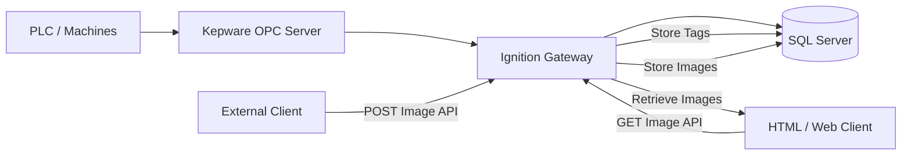
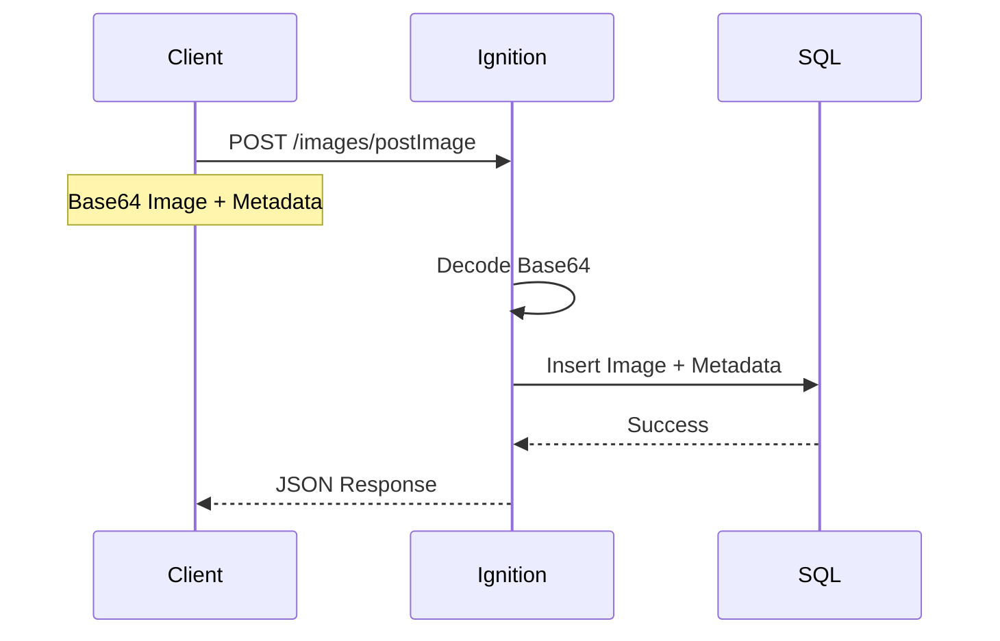
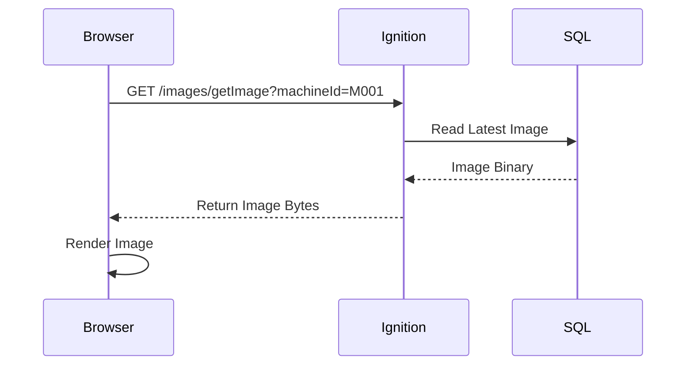
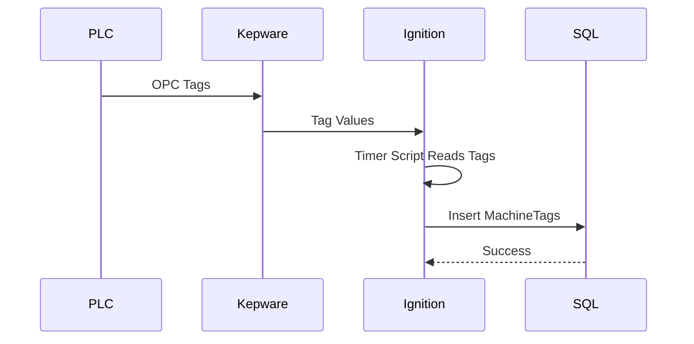
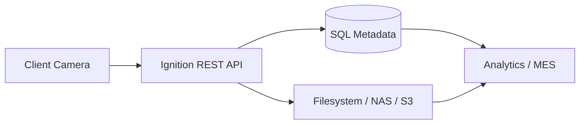

# MES Image & Tag Integration POC

## Overview

This Proof of Concept (POC) demonstrates how Ignition SCADA integrates with Kepware OPC Server, Microsoft SQL Server, REST APIs, and external applications for industrial image and tag management.

The solution enables:

- Real-time OPC tag collection
- Image upload from external systems
- Image retrieval using REST APIs
- Centralized storage in SQL Server
- Web-based image visualization

---

# Business Objectives

- Centralized operational data storage
- API-driven integrations
- Industrial image traceability
- SCADA-to-MES integration
- Foundation for Industry 4.0 initiatives

---

# High Level Architecture



---

# Solution Components

| Component | Purpose |
|---|---|
| Ignition Gateway | Central SCADA & API platform |
| Kepware OPC Server | OPC communication |
| SQL Server | Stores tags and images |
| REST APIs | External integrations |
| HTML Client | Displays images |
| Python Clients | Upload images |

---

# End-to-End Flow

## Image Upload Flow



---

# Image Retrieval Flow



---

# OPC Tag Collection Flow



---

# Database Design

## MachineTags Table

| Column | Description |
|---|---|
| machineId | Machine Identifier |
| tagName | OPC Tag Path |
| tagValue | Tag Value |
| tagTimestamp | Timestamp |

---

## Images Table

| Column | Description |
|---|---|
| machineId | Machine Identifier |
| imageName | Image File Name |
| imageData | Image Binary |
| imageType | jpg/png |
| createdAt | Upload Time |

---

# Technology Stack

| Layer | Technology |
|---|---|
| SCADA | Ignition |
| OPC | Kepware |
| Database | Microsoft SQL Server |
| APIs | Ignition WebDev |
| Scripting | Python / Jython |
| Frontend | HTML / JavaScript |

---

# REST APIs

## POST Image API

### Endpoint

```plaintext
/system/webdev/samplequickstart/MESIntegration/api/images/postImage
```

### Method

```plaintext
POST
```

### Payload

```json
{
  "machineId": "M001",
  "imageName": "sample.jpg",
  "imageType": "jpeg",
  "imageData": "BASE64_STRING"
}
```

---

# GET Image API

### Endpoint

```plaintext
/system/webdev/samplequickstart/MESIntegration/api/images/getImage?machineId=M001
```

### Method

```plaintext
GET
```

---

# Sample HTML Viewer

```html
<!DOCTYPE html>
<html>

<body>

<h2>MES Image Viewer</h2>


</body>

</html>
```

---

# Security Recommendations

| Area | Recommendation |
|---|---|
| REST APIs | API Key Authentication |
| HTTPS | Enable SSL |
| SQL | Least Privilege Access |
| Upload Size | File Size Validation |
| CORS | Restrict Origins |

---

# Scalability Recommendations

## Current POC

```plaintext
Images stored in SQL Server
```

Suitable for:

- Small deployments
- Prototype environments

---

## Recommended Production Design



Benefits:

- Better scalability
- Lower database growth
- Faster image retrieval
- Easier backups

---

# Future Enhancements

- AI Defect Detection
- Grafana Dashboards
- MQTT Integration
- Cloud Storage
- Batch Traceability
- Alarm Notifications

---

# Benefits

| Benefit | Value |
|---|---|
| Faster Integration | Rapid onboarding |
| Centralized Visibility | Unified operations |
| Open APIs | Vendor-neutral integration |
| Automation | Reduced manual effort |
| Industry 4.0 Ready | Future scalability |

---

# Conclusion

This POC demonstrates a modern industrial integration architecture using:

- Ignition SCADA
- Kepware OPC
- SQL Server
- REST APIs
- HTML Visualization

The solution provides a scalable foundation for MES, analytics, AI inspection, and enterprise manufacturing integrations.