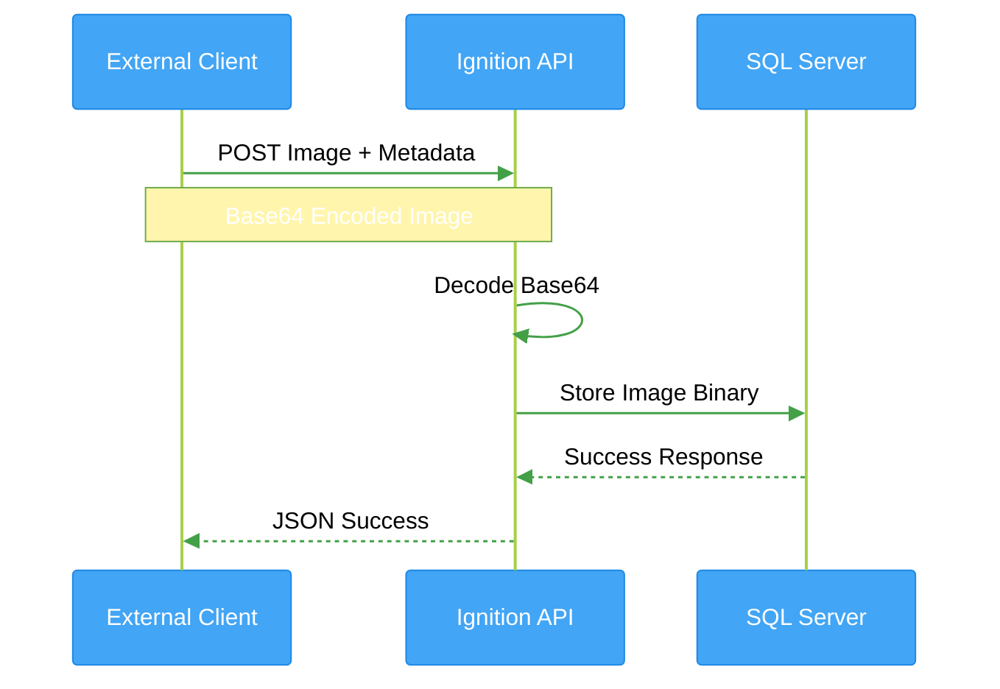
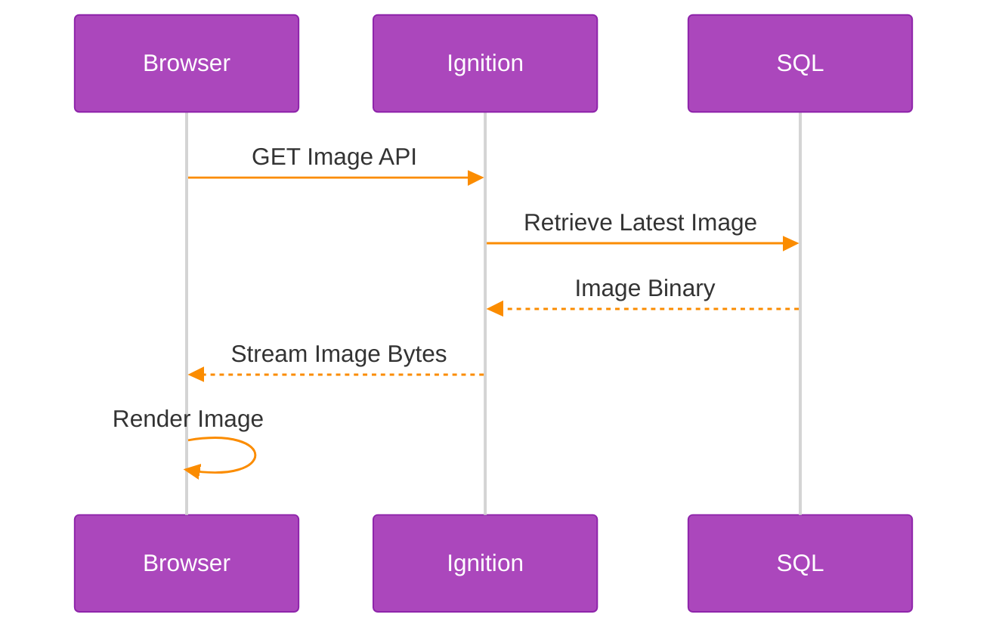
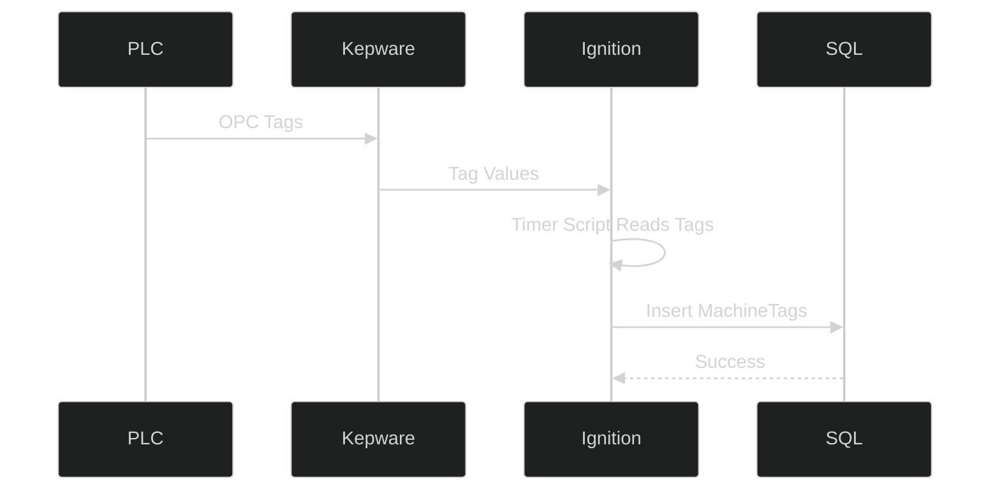

# MES Image & Tag Integration POC

## Executive Summary

This Proof of Concept (POC) demonstrates a modern industrial integration architecture using Ignition SCADA, Kepware OPC, Microsoft SQL Server, REST APIs, and Web technologies.

The solution enables:

* Real-time OPC tag collection from machines
* Image upload and retrieval using REST APIs
* Centralized operational data storage
* Browser-based visualization
* Scalable MES/Industry 4.0 integration foundation

---

## Business Benefits

| Benefit                | Description                                   |
| ---------------------- | --------------------------------------------- |
| Centralized Visibility | Unified machine tags and image management     |
| Open Architecture      | REST API driven integrations                  |
| Reduced Manual Work    | Automated image and tag capture               |
| Future Ready           | Supports MES, AI and Analytics initiatives    |
| Fast Integration       | Rapid onboarding of machines and applications |

---


## High Level Architecture


```mermaid
%%{init: {
  'theme': 'base',
  'themeVariables': {
    'primaryColor': '#4CAF50',
    'primaryTextColor': '#ffffff',
    'primaryBorderColor': '#1B5E20',
    'lineColor': '#0288D1',
    'secondaryColor': '#FF9800',
    'tertiaryColor': '#E3F2FD',
    'fontSize': '16px'
  },
  'flowchart': {
    'curve': 'basis'
  }
}}%%

flowchart LR

A[PLC / Machines]
:::machine
--> B[Kepware OPC Server]

B --> C[Ignition Gateway]

C --> D[(SQL Server)]

E[External Client]
:::client
-. POST Image API .-> C

F[HTML / Web Client]
:::web
-. GET Image API .-> C

C -->|Store Tags| D
C -->|Store Images| D
C -->|Retrieve Images| F

classDef machine fill:#1565C0,stroke:#0D47A1,color:#fff,stroke-width:3px;
classDef client fill:#EF6C00,stroke:#E65100,color:#fff,stroke-width:3px;
classDef web fill:#6A1B9A,stroke:#4A148C,color:#fff,stroke-width:3px;
```

---


# Image Upload Flow



---


# Image Retrieval Flow



---


# OPC Tag Collection Flow



---

# Animated Flow Diagram


---

# Notes

* Mermaid animations and colors work best in:

  * GitHub Markdown
  * GitLab
  * VS Code Mermaid Preview
  * Obsidian
  * MkDocs

* Some Markdown viewers may not support advanced Mermaid themes.

* For full animated arrows and interactive architecture diagrams, recommended tools:

  * Draw.io
  * Excalidraw
  * Lucidchart
  * Mermaid Live Editor
